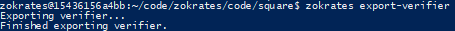

- [Udacity Blockchain Capstone](#udacity-blockchain-capstone)
	- [1. PROJECT SPECIFICATION](#1-project-specification)
		- [1.1 Project Deliverables](#11-project-deliverables)
		- [1.2 ERC721](#12-erc721)
		- [1.3 Zokrates](#13-zokrates)
		- [1.4 OpenSea Marketplace](#14-opensea-marketplace)
		- [1.5 Deployment](#15-deployment)
	- [2 Versions](#2-versions)
	- [3. Project Steps](#3-project-steps)
	- [4 Setup](#4-setup)
		- [4.1 Install](#41-install)
			- [4.2 GANACHE setup](#42-ganache-setup)
	- [4.2 Implement Zokrates](#42-implement-zokrates)
			- [Migrate smart contracts to the locally running blockchain, ganache-cli:](#migrate-smart-contracts-to-the-locally-running-blockchain-ganache-cli)
		- [4.3 Tests](#43-tests)
		- [4.4 Deploying](#44-deploying)
		- [4.5 Mint Tokens](#45-mint-tokens)
- [6. Real State Marketplace](#6-real-state-marketplace)
		- [6.1 Generate OpenSea marketplace](#61-generate-opensea-marketplace)
		- [6.3 List and Purchase on the marketplace](#63-list-and-purchase-on-the-marketplace)
- [5. Deployed Contracts Info](#5-deployed-contracts-info)
- [6. Project Resources](#6-project-resources)

# Udacity Blockchain Capstone

The capstone will build upon the knowledge you have gained in the course in order to build a decentralized housing product. You will be minting your own tokens to represent your title to the real estate properties. Before you mint a token, you need to verify your own the property. You will use zk-SNARKs to create a verification system which can prove you have title to the property without revealing that specific information on the property. Once the token has been verified you will place it on a blockchain market place (OpenSea) for others to purchase. The detail steps of the project is as follows:
  1. building of the ERC 721 tokens for the real estate homes
  2. compiling and integrating zokrates into the tokens that is just built


## 1. PROJECT SPECIFICATION
Capstone: Real Estate Marketplace

### 1.1 Project Deliverables

| CRITERIA | MEETS SPECIFICATIONS | Status |
|:-------:|:-------|:--------|
| Write Up | Student includes a README to explain how to test their code. | :ok_hand: |
| Write Up | Student provides Contract Addresses, Contract Abi's, OpenSea MarketPlace Storefront link's. | :ok_hand: |

### 1.2 ERC721

| CRITERIA | MEETS SPECIFICATIONS | Status |
|:-------:|:-------|:--------|
| ERC721 Mintable Contract | Student completes the boilerplate ERC721 Mintable Contract in ERC721Mintable.sol | :ok_hand: |
| ERC721 Mintable Contract Test Cases | Student writes and passes the test cases in TestERC721Mintable.js | :ok_hand: |
| ERC721 Mintable Contract Zokrates Test | Student writes and passes the test cases in 'TestSquareVerifier.js' | :ok_hand: |
| ERC721 Mintable Contract Zokrates Test Cases | Student writes and passes the test cases in TestSolnSquareVerifier.js | :ok_hand: |

### 1.3 Zokrates

| CRITERIA | MEETS SPECIFICATIONS | Status |
|:-------:|:-------|:--------|
| Zokrates program written using DSL | Student completes the Zokrates proof in square.code by adding the variable names in square.code | :ok_hand: |
| Zokrates Test Cases | Student completes test contract in SolnSquareVerifier.sol | :ok_hand: |
| Zokrates Test Cases | Student writes and passes the test cases in 'TestSolnSquareVerifier.js' | :ok_hand: |

### 1.4 OpenSea Marketplace

| CRITERIA | MEETS SPECIFICATIONS | Status |
|:-------:|:-------|:--------|
| Market Place | Student list ERC721/ ZoKrates tokens & complete transactions on market place | :ok_hand: |


### 1.5 Deployment
| CRITERIA | MEETS SPECIFICATIONS | Status |
|:-------:|:-------|:--------|
| Deployment | Student deploys ERC721 contracts with Zokrates integration. | :ok_hand: |

## 2 Versions
`truffle version`
- Truffle v5.1.66 (core: 5.1.66)
- Solidity v0.5.16 (solc-js)
- Node v14.15.5
- Web3.js v1.2.9

## 3. Project Steps

1. Clone the project repository
2. Explore the code base.
3. Fill out ERC721 Mintable Contract in ERC721Mintable.sol
4. Write test cases TestERC721Mintable.js
5. Compile and pass test cases in TestERC721Mintable.js
6. Implement Zokrates
   1. Using Docker to install and instantiate a Zokrates zkSnarks development environment
   2. Completes the Zokrates proof in square.code by adding the variable names in square.code
   3. Compile program
   4. Trusted setup
   5. Compute witness
   6. Generate Proof
   7. Export Verifier.sol
   8. Note: This project uses solidity version 0.5.2 so you will be required to update the code in Verifier.sol accordingly based on the compiler errors you receive
7. Write a test script to verify the solidity contract generated by Zokrates executed successfully 1. TestSquareVerifier.js
8.  Write test contract for ZK and ERC721 integration 1. SolnSquareVerifier.sol
9.  Compile and pass with TestSolnSquareVerifier.js
10. Deploy latest contracts generated by Zokrates (a.k.a verifier.sol)
11. Deploy SolnSquareVerifier contract to Rinkeby network
12. Mint 10 tokens
13. Generate OpenSea marketplace
14. Test and Verify OpenSea with your SolnSquareVerifier tokens
    1.  List 5 of your tokens on the marketplace
    2.  Purchase those 5 tokens using a different address
15. Complete required documentation and submit!


## 4 Setup


### 4.1 Install
This repository contains Smart Contract code in Solidity (using Truffle), tests (also using Truffle)

To install, download or clone the repo, then execute:

```
nvm install 14.15.5
nvm use 14.15.5
npm install -g truffle
npm install
cd eth-contracts/
truffle compile
```

#### 4.2 GANACHE setup

Download and install Ganache v2.5.4: <https://www.trufflesuite.com/ganache>

Run Ganache follow the steps:
- on `Workspace` Tab:
	- select `NEW WORKSPACE - Ethereum`
	- enter Workspace name: `Capstone`
	- click on `ADD PROJECT` and add the `truffle-config.js` file.
- on `Server` Tab:
	- change `Port number` to `8545`.
- on `Accounts and Keys` Tab:
	- change `TOTAL ACCOUNTS TO GENERATE` to 5
	- change the `Mnemonic` to `depart quit survey faint message service talk spider urge dynamic jewel fancy`
	- The `Mnemonic` shall be the same text of the `\\eth-contracts\\.secret` file contents.
- on `Chain` Tab:
	- change the `GAS LIMIT` to `9999999`
- Then click on `SAVE WORKSPACE` button.

Open your saved workspace:


## 4.2 Implement Zokrates
| Step | Details |
|-------------|-------------|
| Step 1: Install Docker | [docker install](https://docs.docker.com/install/)|
| Step 2: Run ZoKrates | `docker run -v <path to your GIT project folder>:/home/zokrates/code -ti zokrates/zokrates /bin/bash`| 


| Step | Details | Output |
|-------------|-------------|-------------|
| Step 3: Compile the ZoKrates DSL | `cd code/zokrates/code/square/` </br></br> `zokrates compile -i square.code` |   |
| Step 4: Generate the Trusted Setup | `zokrates setup` |   |
| Step 5: Compute Witness | `zokrates compute-witness -a 3 9` |  |
| Step 6: Generate Proof | `zokrates generate-proof` |  |
| Step 7: Export Verifier | `zokrates export-verifier`|  |

#### Migrate smart contracts to the locally running blockchain, ganache-cli:

```
cd eth-contracts/
truffle migrate --reset
```
This will :
  - deploy the smart contract artifacts to running Ganache 
  
### 4.3 Tests
To run truffle tests: In directory eth-contracts/

For all tests:
```
cd eth-contracts/
truffle test
```
All 11 tests should pass.


For single file tests:
| Test | Output |
|-------------|-------------|
| truffle test test/TestERC721Mintable.js |  |
| truffle test test/TestSquareVerifier.js |  |
| truffle** test test/TestSolnSquareVerifier.js |  |


### 4.4 Deploying

`truffle migrate --network rinkeby --reset`

Output:


### 4.5 Mint Tokens

Mint 10 tokens using `scripts/mint.js`
```
cd scripts
node mint.js
```

Output:
```
-------------------------------------------
OWNER_ADDRESS: 0xAC1bAde854beFc9cC81C13F258a4DEe38c4cf91a
tokenId: 1
totalSupplyBefore:  0
Minted item. Transaction: 0xada52609b0337453869efeab8be04e4b58ea5337d3090a8c58c9d1ad42bb7510
-------------------------------------------
OWNER_ADDRESS: 0xAC1bAde854beFc9cC81C13F258a4DEe38c4cf91a
tokenId: 2
totalSupplyBefore:  1
Minted item. Transaction: 0xbd15baa4ff82cad0be2d72a0651f584a962f17bf51b51f37cf6dbc4ff099bac0
-------------------------------------------
OWNER_ADDRESS: 0xAC1bAde854beFc9cC81C13F258a4DEe38c4cf91a
tokenId: 3
totalSupplyBefore:  2
Minted item. Transaction: 0xb59e9288f99435c4fd7f585c3a7c9811bcdbf885b15d106fc40eb09e2560977e
-------------------------------------------
OWNER_ADDRESS: 0xAC1bAde854beFc9cC81C13F258a4DEe38c4cf91a
tokenId: 4
totalSupplyBefore:  3
Minted item. Transaction: 0x6e41b1536c39482fe8ee0c1b8e3cdc0d96d705554fad95ef33576d72023a3fc8
-------------------------------------------
OWNER_ADDRESS: 0xAC1bAde854beFc9cC81C13F258a4DEe38c4cf91a
tokenId: 5
totalSupplyBefore:  4
Minted item. Transaction: 0xbbacc140e8e883844b22157104222e19801887159b6a05ee1e8da6c7bbc57448
-------------------------------------------
OWNER_ADDRESS: 0xAC1bAde854beFc9cC81C13F258a4DEe38c4cf91a
tokenId: 6
totalSupplyBefore:  5
Minted item. Transaction: 0x2161b34fb99361f0f5cdfd4b3ddb0f6357b2d9ccc4f34a10c3d9e080995d965c
-------------------------------------------
OWNER_ADDRESS: 0xAC1bAde854beFc9cC81C13F258a4DEe38c4cf91a
tokenId: 7
totalSupplyBefore:  6
Minted item. Transaction: 0x246922b35a16e9a53a796f4c78b2fc02f3a7824e6262f827afe235c5a62a6d1a
-------------------------------------------
OWNER_ADDRESS: 0xAC1bAde854beFc9cC81C13F258a4DEe38c4cf91a
tokenId: 8
totalSupplyBefore:  7
Minted item. Transaction: 0x422e90914e006bfa7e974389f586434e1d8b6ea2cac8c4ee9c5541aefcd923bf
-------------------------------------------
OWNER_ADDRESS: 0xAC1bAde854beFc9cC81C13F258a4DEe38c4cf91a
tokenId: 9
totalSupplyBefore:  8
Minted item. Transaction: 0x917e204a433521feec51bb70906ee0a37bacf3b60b6380c844e255c3a137cb16
-------------------------------------------
OWNER_ADDRESS: 0xAC1bAde854beFc9cC81C13F258a4DEe38c4cf91a
tokenId: 10
totalSupplyBefore:  9
Minted item. Transaction: 0x3e3b4f7b5b1b5c02d407fc7e71827b88676efb9745dd0d406c66f02d50fac776
```

Open the Etherscan and check the Tokens generated by address owner: [Ribas Tokens link](https://rinkeby.etherscan.io/token/0x7968e940c8b66a7d9468752dfd8aab1c75f395c6?a=0xac1bade854befc9cc81c13f258a4dee38c4cf91a)


# 6. Real State Marketplace

The goal of this project to create a decentralized house listing service. The real estate properties are represented by ERC721 tokens. We are using the zk-SNARKs toolbox from ZoKrates to establish a verification mechanism before minting each tokens. Finally, the tokens are listed and able for exchange on the blockchain market place OpenSea. On OpenSea, you can buy or sell any of these items through a smart contract, meaning that no central authority ever holds custody of your items.

### 6.1 Generate OpenSea marketplace

Open the the [Ribas token Marketplace link](https://testnets.opensea.io/assets/ribas-token)


### 6.3 List and Purchase on the marketplace
Test and Verify OpenSea with your SolnSquareVerifier tokens
List 5 of your tokens on the marketplace
Purchase those 5 tokens using a different address


# 5. Deployed Contracts Info
- Contract Address on Rinkeby Network

| Contract Name | Contract Address |
| ------------- | ------------- |
| Migrations | [0xbc9d7Df93c36C50dcfd7Ad4F2cd1d63233e35E94](https://rinkeby.etherscan.io/address/0xbc9d7Df93c36C50dcfd7Ad4F2cd1d63233e35E94) |
| Verifier | [0x579E1C26e1BaF3BD0Ab2396b5BB14E110F876355](https://rinkeby.etherscan.io/address/0x579E1C26e1BaF3BD0Ab2396b5BB14E110F876355) |
| SolnSquareVerifier | [0x7968e940c8b66A7D9468752DFd8aAb1C75f395C6](https://rinkeby.etherscan.io/address/0x7968e940c8b66A7D9468752DFd8aAb1C75f395C6) |

- Contract Abi's

Just open the `\eth-contracts\build\contracts\SolnSquareVerifier.json` file and get abi:

```
"abi": [
    {
      "inputs": [
        {
          "internalType": "string",
          "name": "name",
          "type": "string"
        },
        {
          "internalType": "string",
          "name": "symbol",
          "type": "string"
        }
      ],
      "payable": false,
      "stateMutability": "nonpayable",
      "type": "constructor"
    },
    {
      "anonymous": false,
      "inputs": [
        {
          "indexed": true,
          "internalType": "address",
          "name": "owner",
          "type": "address"
        },
        {
          "indexed": true,
          "internalType": "address",
          "name": "approved",
          "type": "address"
        },
        {
          "indexed": true,
          "internalType": "uint256",
          "name": "tokenId",
          "type": "uint256"
        }
      ],
      "name": "Approval",
      "type": "event"
    },
    {
      "anonymous": false,
      "inputs": [
        {
          "indexed": true,
          "internalType": "address",
          "name": "owner",
          "type": "address"
        },
        {
          "indexed": true,
          "internalType": "address",
          "name": "operator",
          "type": "address"
        },
        {
          "indexed": false,
          "internalType": "bool",
          "name": "approved",
          "type": "bool"
        }
      ],
      "name": "ApprovalForAll",
      "type": "event"
    },
    {
      "anonymous": false,
      "inputs": [
        {
          "indexed": false,
          "internalType": "address",
          "name": "newOwner",
          "type": "address"
        }
      ],
      "name": "OwnershipTransfered",
      "type": "event"
    },
    {
      "anonymous": false,
      "inputs": [
        {
          "indexed": false,
          "internalType": "address",
          "name": "account",
          "type": "address"
        }
      ],
      "name": "Paused",
      "type": "event"
    },
    {
      "anonymous": false,
      "inputs": [
        {
          "indexed": false,
          "internalType": "uint256",
          "name": "index",
          "type": "uint256"
        },
        {
          "indexed": false,
          "internalType": "address",
          "name": "wallet",
          "type": "address"
        }
      ],
      "name": "SolutionAdded",
      "type": "event"
    },
    {
      "anonymous": false,
      "inputs": [
        {
          "indexed": false,
          "internalType": "uint256",
          "name": "index",
          "type": "uint256"
        },
        {
          "indexed": false,
          "internalType": "address",
          "name": "wallet",
          "type": "address"
        }
      ],
      "name": "TokenMint",
      "type": "event"
    },
    {
      "anonymous": false,
      "inputs": [
        {
          "indexed": false,
          "internalType": "address",
          "name": "to",
          "type": "address"
        },
        {
          "indexed": false,
          "internalType": "uint256",
          "name": "tokenId",
          "type": "uint256"
        }
      ],
      "name": "TokenMinted",
      "type": "event"
    },
    {
      "anonymous": false,
      "inputs": [
        {
          "indexed": true,
          "internalType": "address",
          "name": "from",
          "type": "address"
        },
        {
          "indexed": true,
          "internalType": "address",
          "name": "to",
          "type": "address"
        },
        {
          "indexed": true,
          "internalType": "uint256",
          "name": "tokenId",
          "type": "uint256"
        }
      ],
      "name": "Transfer",
      "type": "event"
    },
    {
      "anonymous": false,
      "inputs": [
        {
          "indexed": false,
          "internalType": "address",
          "name": "account",
          "type": "address"
        }
      ],
      "name": "Unpaused",
      "type": "event"
    },
    {
      "constant": false,
      "inputs": [
        {
          "internalType": "bytes32",
          "name": "_myid",
          "type": "bytes32"
        },
        {
          "internalType": "string",
          "name": "_result",
          "type": "string"
        }
      ],
      "name": "__callback",
      "outputs": [],
      "payable": false,
      "stateMutability": "nonpayable",
      "type": "function"
    },
    {
      "constant": false,
      "inputs": [
        {
          "internalType": "bytes32",
          "name": "_myid",
          "type": "bytes32"
        },
        {
          "internalType": "string",
          "name": "_result",
          "type": "string"
        },
        {
          "internalType": "bytes",
          "name": "_proof",
          "type": "bytes"
        }
      ],
      "name": "__callback",
      "outputs": [],
      "payable": false,
      "stateMutability": "nonpayable",
      "type": "function"
    },
    {
      "constant": true,
      "inputs": [],
      "name": "_owner",
      "outputs": [
        {
          "internalType": "address",
          "name": "",
          "type": "address"
        }
      ],
      "payable": false,
      "stateMutability": "view",
      "type": "function"
    },
    {
      "constant": false,
      "inputs": [
        {
          "internalType": "address",
          "name": "to",
          "type": "address"
        },
        {
          "internalType": "uint256",
          "name": "tokenId",
          "type": "uint256"
        }
      ],
      "name": "approve",
      "outputs": [],
      "payable": false,
      "stateMutability": "nonpayable",
      "type": "function"
    },
    {
      "constant": true,
      "inputs": [
        {
          "internalType": "address",
          "name": "owner",
          "type": "address"
        }
      ],
      "name": "balanceOf",
      "outputs": [
        {
          "internalType": "uint256",
          "name": "",
          "type": "uint256"
        }
      ],
      "payable": false,
      "stateMutability": "view",
      "type": "function"
    },
    {
      "constant": true,
      "inputs": [],
      "name": "baseTokenURI",
      "outputs": [
        {
          "internalType": "string",
          "name": "",
          "type": "string"
        }
      ],
      "payable": false,
      "stateMutability": "view",
      "type": "function"
    },
    {
      "constant": true,
      "inputs": [
        {
          "internalType": "uint256",
          "name": "tokenId",
          "type": "uint256"
        }
      ],
      "name": "getApproved",
      "outputs": [
        {
          "internalType": "address",
          "name": "",
          "type": "address"
        }
      ],
      "payable": false,
      "stateMutability": "view",
      "type": "function"
    },
    {
      "constant": true,
      "inputs": [],
      "name": "getOwner",
      "outputs": [
        {
          "internalType": "address",
          "name": "",
          "type": "address"
        }
      ],
      "payable": false,
      "stateMutability": "view",
      "type": "function"
    },
    {
      "constant": true,
      "inputs": [
        {
          "internalType": "address",
          "name": "owner",
          "type": "address"
        },
        {
          "internalType": "address",
          "name": "operator",
          "type": "address"
        }
      ],
      "name": "isApprovedForAll",
      "outputs": [
        {
          "internalType": "bool",
          "name": "",
          "type": "bool"
        }
      ],
      "payable": false,
      "stateMutability": "view",
      "type": "function"
    },
    {
      "constant": false,
      "inputs": [
        {
          "internalType": "address",
          "name": "to",
          "type": "address"
        },
        {
          "internalType": "uint256",
          "name": "tokenId",
          "type": "uint256"
        }
      ],
      "name": "mint",
      "outputs": [
        {
          "internalType": "bool",
          "name": "",
          "type": "bool"
        }
      ],
      "payable": false,
      "stateMutability": "nonpayable",
      "type": "function"
    },
    {
      "constant": true,
      "inputs": [],
      "name": "name",
      "outputs": [
        {
          "internalType": "string",
          "name": "",
          "type": "string"
        }
      ],
      "payable": false,
      "stateMutability": "view",
      "type": "function"
    },
    {
      "constant": true,
      "inputs": [
        {
          "internalType": "uint256",
          "name": "tokenId",
          "type": "uint256"
        }
      ],
      "name": "ownerOf",
      "outputs": [
        {
          "internalType": "address",
          "name": "",
          "type": "address"
        }
      ],
      "payable": false,
      "stateMutability": "view",
      "type": "function"
    },
    {
      "constant": false,
      "inputs": [],
      "name": "pause",
      "outputs": [],
      "payable": false,
      "stateMutability": "nonpayable",
      "type": "function"
    },
    {
      "constant": false,
      "inputs": [
        {
          "internalType": "address",
          "name": "from",
          "type": "address"
        },
        {
          "internalType": "address",
          "name": "to",
          "type": "address"
        },
        {
          "internalType": "uint256",
          "name": "tokenId",
          "type": "uint256"
        }
      ],
      "name": "safeTransferFrom",
      "outputs": [],
      "payable": false,
      "stateMutability": "nonpayable",
      "type": "function"
    },
    {
      "constant": false,
      "inputs": [
        {
          "internalType": "address",
          "name": "from",
          "type": "address"
        },
        {
          "internalType": "address",
          "name": "to",
          "type": "address"
        },
        {
          "internalType": "uint256",
          "name": "tokenId",
          "type": "uint256"
        },
        {
          "internalType": "bytes",
          "name": "_data",
          "type": "bytes"
        }
      ],
      "name": "safeTransferFrom",
      "outputs": [],
      "payable": false,
      "stateMutability": "nonpayable",
      "type": "function"
    },
    {
      "constant": false,
      "inputs": [
        {
          "internalType": "address",
          "name": "to",
          "type": "address"
        },
        {
          "internalType": "bool",
          "name": "approved",
          "type": "bool"
        }
      ],
      "name": "setApprovalForAll",
      "outputs": [],
      "payable": false,
      "stateMutability": "nonpayable",
      "type": "function"
    },
    {
      "constant": false,
      "inputs": [
        {
          "internalType": "bool",
          "name": "set",
          "type": "bool"
        }
      ],
      "name": "setter",
      "outputs": [],
      "payable": false,
      "stateMutability": "nonpayable",
      "type": "function"
    },
    {
      "constant": true,
      "inputs": [
        {
          "internalType": "bytes4",
          "name": "interfaceId",
          "type": "bytes4"
        }
      ],
      "name": "supportsInterface",
      "outputs": [
        {
          "internalType": "bool",
          "name": "",
          "type": "bool"
        }
      ],
      "payable": false,
      "stateMutability": "view",
      "type": "function"
    },
    {
      "constant": true,
      "inputs": [],
      "name": "symbol",
      "outputs": [
        {
          "internalType": "string",
          "name": "",
          "type": "string"
        }
      ],
      "payable": false,
      "stateMutability": "view",
      "type": "function"
    },
    {
      "constant": true,
      "inputs": [
        {
          "internalType": "uint256",
          "name": "index",
          "type": "uint256"
        }
      ],
      "name": "tokenByIndex",
      "outputs": [
        {
          "internalType": "uint256",
          "name": "",
          "type": "uint256"
        }
      ],
      "payable": false,
      "stateMutability": "view",
      "type": "function"
    },
    {
      "constant": true,
      "inputs": [
        {
          "internalType": "address",
          "name": "owner",
          "type": "address"
        },
        {
          "internalType": "uint256",
          "name": "index",
          "type": "uint256"
        }
      ],
      "name": "tokenOfOwnerByIndex",
      "outputs": [
        {
          "internalType": "uint256",
          "name": "",
          "type": "uint256"
        }
      ],
      "payable": false,
      "stateMutability": "view",
      "type": "function"
    },
    {
      "constant": true,
      "inputs": [
        {
          "internalType": "uint256",
          "name": "tokenId",
          "type": "uint256"
        }
      ],
      "name": "tokenURI",
      "outputs": [
        {
          "internalType": "string",
          "name": "",
          "type": "string"
        }
      ],
      "payable": false,
      "stateMutability": "view",
      "type": "function"
    },
    {
      "constant": true,
      "inputs": [],
      "name": "totalSupply",
      "outputs": [
        {
          "internalType": "uint256",
          "name": "",
          "type": "uint256"
        }
      ],
      "payable": false,
      "stateMutability": "view",
      "type": "function"
    },
    {
      "constant": false,
      "inputs": [
        {
          "internalType": "address",
          "name": "from",
          "type": "address"
        },
        {
          "internalType": "address",
          "name": "to",
          "type": "address"
        },
        {
          "internalType": "uint256",
          "name": "tokenId",
          "type": "uint256"
        }
      ],
      "name": "transferFrom",
      "outputs": [],
      "payable": false,
      "stateMutability": "nonpayable",
      "type": "function"
    },
    {
      "constant": false,
      "inputs": [
        {
          "internalType": "address",
          "name": "newOwner",
          "type": "address"
        }
      ],
      "name": "transferOwnership",
      "outputs": [],
      "payable": false,
      "stateMutability": "nonpayable",
      "type": "function"
    },
    {
      "constant": false,
      "inputs": [],
      "name": "unpause",
      "outputs": [],
      "payable": false,
      "stateMutability": "nonpayable",
      "type": "function"
    },
    {
      "constant": false,
      "inputs": [
        {
          "internalType": "uint256",
          "name": "index",
          "type": "uint256"
        },
        {
          "internalType": "address",
          "name": "wallet",
          "type": "address"
        }
      ],
      "name": "addSolution",
      "outputs": [],
      "payable": false,
      "stateMutability": "nonpayable",
      "type": "function"
    },
    {
      "constant": false,
      "inputs": [
        {
          "internalType": "uint256[2]",
          "name": "a",
          "type": "uint256[2]"
        },
        {
          "internalType": "uint256[2][2]",
          "name": "b",
          "type": "uint256[2][2]"
        },
        {
          "internalType": "uint256[2]",
          "name": "c",
          "type": "uint256[2]"
        },
        {
          "internalType": "uint256[2]",
          "name": "inputs",
          "type": "uint256[2]"
        },
        {
          "internalType": "uint256",
          "name": "index",
          "type": "uint256"
        },
        {
          "internalType": "address",
          "name": "wallet",
          "type": "address"
        }
      ],
      "name": "mintNFT",
      "outputs": [],
      "payable": false,
      "stateMutability": "nonpayable",
      "type": "function"
    }
  ]
```
- OpenSea MarketPlace Storefront link's
 * Ribas token Marketplace link: https://testnets.opensea.io/assets/ribas-token
 * Marketplace Seller: https://testnets.opensea.io/accounts/0xac1bade854befc9cc81c13f258a4dee38c4cf91a
 * Marketplace Buyer: https://testnets.opensea.io/accounts/0xea3624c7da9c50fc15a75c85441ac1ff60bb4263


# 6. Project Resources

* [Remix - Solidity IDE](https://remix.ethereum.org/)
* [Visual Studio Code](https://code.visualstudio.com/)
* [Truffle Framework](https://truffleframework.com/)
* [Ganache - One Click Blockchain](https://truffleframework.com/ganache)
* [Open Zeppelin ](https://openzeppelin.org/)
* [Interactive zero knowledge 3-colorability demonstration](http://web.mit.edu/~ezyang/Public/graph/svg.html)
* [Docker](https://docs.docker.com/install/)
* [ZoKrates](https://github.com/Zokrates/ZoKrates)

